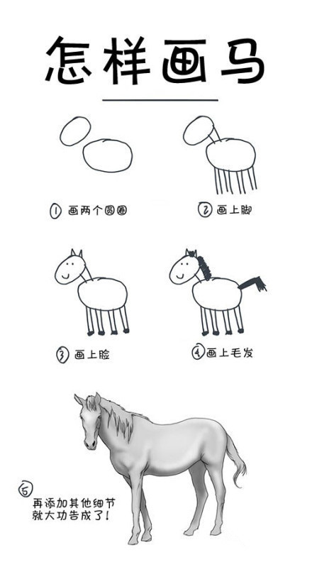

# 9.9

> 这里不是一个API文档网站，这是一个前端工程师根据 `docsify` 编写的一个个人网站。

## 为什么要搞成这样呢？一点都不炫酷

:heart: 喜欢呗，简洁，大方。

## 弄这个东西为了什么呢？

* 分享博客类文章
* 分享排坑踩坑记
* 分享日常BUG记录
* 吐槽
* 什么都聊

## 我也想弄一个这样的网站怎么办？

没问题，上车！

先了解了解 [docsify](https://docsify.js.org/#/) 这个东西，然后按照我下面的步骤就可以了。

然后请君在鄙人的网站上自由的遨游吧,我就先溜了。

